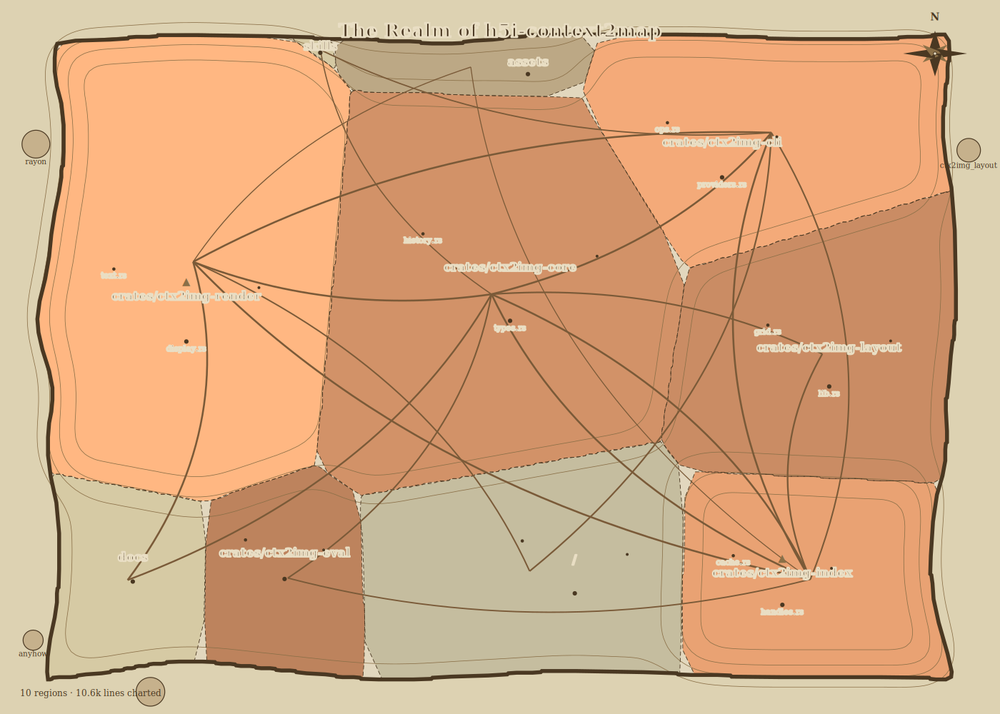

# context2map (`c2m`)

**Your context as a map your AI can actually read.**

`c2m` renders the text an agent must ingest — a whole repository, a prompt, a
doc, tool output — into **dense, structured images** that cost a fraction of
the tokens. A codebase becomes a *Repository Atlas*: a query-conditioned map
a VLM surveys in ~2,000 tokens, zooms into territory tiles that carry the
**actual source typeset inside each file's cell**, and resolves back to
guaranteed-exact text through stable handles. Any other text becomes dense
`paint` pages (measured on this repo's own design doc: **76% fewer tokens**).
Written in Rust; a 5,000-file repo maps **cold in ~0.4 s**.



*(this image is `c2m badge` run on this repo — regenerate it any time)*

## The idea

Dumping context into an LLM costs tokens by the character; an image costs
tokens by its pixel dimensions, no matter how much text it holds. Recent work
(DeepSeek-OCR, Glyph, "Text or Pixels?", LensVLM) shows modern VLMs read
rendered text reliably at 2–4× effective compression — and that the failures
concentrate in *exactness*: high-entropy strings silently misread. `c2m` is
built around that split:

- **Pixels carry text at a chosen density, plus structure** — topology,
  size, task relevance, hazards, dependencies as cartography:
  - **Position** = module topology · **cell area** = code size · **city
    dots** = important files (PageRank)
  - **Elevation ▲1–▲5** = relevance *to your current task* (lexical +
    embedding + graph diffusion + git churn)
  - **Roads** = imports/references · **red hatch** = trust hazards ·
    **islands** = external dependencies
  - `--codex` tiles typeset each file's real source inside its territory
- **Text carries the guarantees** — every element has a stable handle
  (`R3`, `F103`, `S12`) resolving to exact source via `c2m read`; a
  **verbatim factsheet** (paths, SHAs, IDs extracted as plain text) rides
  next to every rendered page so precision-critical strings are quoted,
  never transcribed from pixels. Scan-compressed-then-expand is the loop
  LensVLM (arXiv:2605.07019) showed reaches full-text parity zero-shot.

## Quickstart

```bash
cargo install --path crates/c2m-cli   # or: cargo build --release

c2m map "fix the session expiry bug"  # atlas.png + legend + handles
c2m zoom R3                           # region tile: files + symbols
c2m zoom R3 --codex                   # territory tile with the SOURCE TEXT inside
c2m read F103 --lines 40:120          # exact source, always text
c2m locate "session"                  # find handles

c2m paint big-context.md              # ANY text → dense image pages + factsheet
cat prompt.txt | c2m paint            # works on stdin too

c2m render --out map.svg              # the pretty human map (parchment theme)
c2m badge                             # README-sized hero image
```

`c2m` never spends tokens on a picture that doesn't pay for itself: `map`
falls back to a text roster on small repos, and `paint` refuses when text is
cheaper (override with `--force`). Every run prints the counterfactual —
image tokens spent vs text tokens avoided.

### `c2m paint`: any text → image pages

Pages follow the provider's *resample contract* (Anthropic: 1568×≤728, so
the encoder sees exactly what you rendered), hard newlines become a visible
`↵` sentinel so packing stays lossless, and a factsheet of exact identifiers
accompanies the images as text. Constants are borrowed from
[pxpipe](https://github.com/teamchong/pxpipe)'s field measurements on live
Claude Code traffic (~3 chars/image-token on dense content, ~99% read
fidelity with reflow) — c2m adds the structured/cartographic layer on top.

### Use it from a coding agent

Copy the bundled skill and your agent gets the whole workflow:

```bash
cp -r skills/c2m ~/.claude/skills/    # Claude Code
```

The atlas legend is self-describing (schema + affordances restated every
render), so any VLM-capable agent can use the CLI directly too.

## Provider-aware token budgeting

`c2m map --provider claude --budget 2000` solves for the largest raster whose
*provider-computed* cost fits the budget, snapped to the provider's patch grid
so no tokens are wasted on padding:

| Provider | Accounting | 1024×1024 costs |
|---|---|---|
| `claude` | ⌈w/28⌉×⌈h/28⌉ patches | 1369 |
| `openai` (gpt-4o/4.1/5) | 70 + 140/tile | 630 |
| `openai-mini` | 32-px patches ×1.62 | 1659 |
| `gemini` (Gemini 3) | fixed steps 280–2240 | 1120 |
| `qwen` (Qwen3-VL) | 32-px blocks | 1026 |

## Measured, not vibes

`c2m calibrate` renders a synthetic repo with planted ground truth (a known
summit, a known hazard, a known dependency) and emits objective probe
questions; with `ANTHROPIC_API_KEY` and `--live` it scores a real model's
map-reading ability. `c2m bench` compares atlas vs text-only localization
accuracy at matched token budgets on your own task set. Legibility is a
tested property here, not an assumption.

Honesty notes, because text-in-pixels has real limits: exact-string recall
from images fails by **silent confabulation** (a misread SHA looks confident
and plausible), which is why the factsheet and `c2m read` exist — never
quote, edit, or hash-compare from pixels. Density that one model reads
cleanly can corrupt on another; treat small fonts as per-model calibrated,
not universal. Instructions and security policy are never rendered into
images.

## Performance

Layout geography is **stable**: cell positions persist in `.c2m/` and only
move when the code structure moves, so spatial memory (yours and the
model's prompt cache) survives across queries.

| Repo | Cold map | Warm map |
|---|---|---|
| this repo (55 files) | 70 ms | 60 ms |
| synthetic, 5,000 files | 0.42 s | 0.42 s |

Everything is deterministic: same tree + same query ⇒ byte-identical PNG.

## How it works

```
ingest (gitignore-aware) → tree-sitter symbols/imports (6 languages)
→ dependency graph + PageRank → hashed TF-IDF embeddings
→ query relevance (BM25 + cosine + personalized-PageRank diffusion + churn)
→ grid power-diagram treemap (persisted, stable geography)
→ themed render (VLM / codex text-flow / parchment) → PNG/SVG + legend
→ + factsheet & sidecar (exactness stays in text)
```

Full design rationale, research grounding, and roadmap: [docs/DESIGN.md](docs/DESIGN.md).

## License

Apache-2.0. Embedded DejaVu fonts under their own license
(`assets/fonts/LICENSE-DejaVu`).
