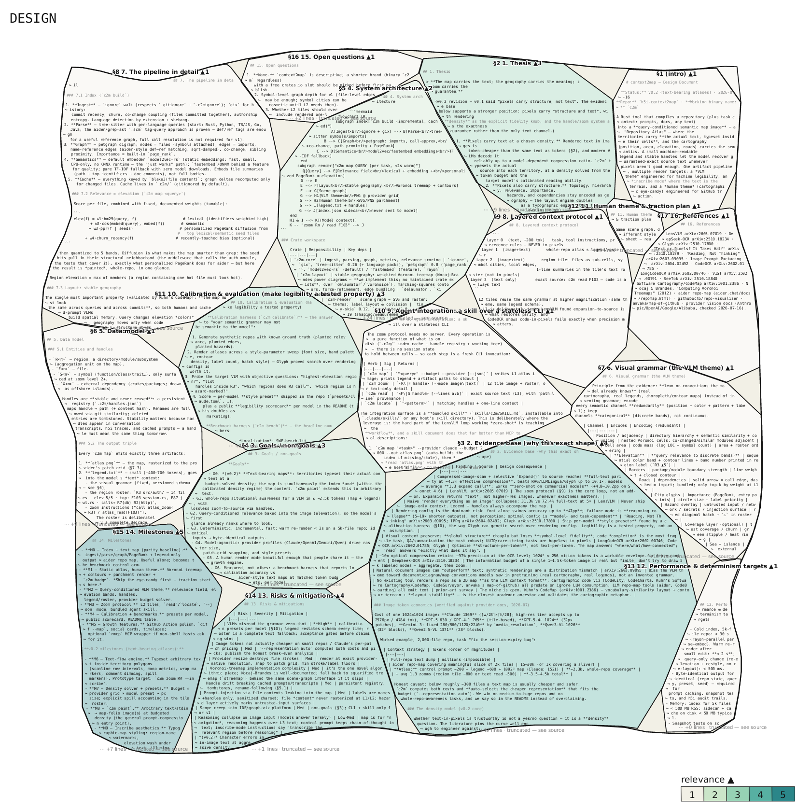

# ctx2img

**Render agent context as images. Same text, roughly 60-75% fewer tokens.**

An image is billed by its pixels, not by how much text it holds. `ctx2img paint`
typesets any text an agent must ingest (a repo, a markdown doc, a prompt,
tool output) into dense, structured images a vision LLM reads directly,
plus a small text *factsheet* so exact identifiers are never trusted to
pixels.



*`ctx2img paint docs/DESIGN.md`: this repo's entire design document (~9,800
text tokens) as **one 2,550-token image**: 74% cheaper, every section a
labeled box, thicker borders = more relevant to your query.*

## Usage

```bash
cargo install --path crates/ctx2img-cli

ctx2img paint <file|dir|->            # THE command: any text → dense image(s)
echo "$PROMPT" | ctx2img paint        # paint any text via stdin — a prompt, a log, a diff
```

What you get depends on the input shape:

| Input | Output | Measured effect |
|---|---|---|
| markdown/doc | one section-map image + `.legend.txt` | 33k-char doc: **9.8k → 2.5k tokens (−74%)** |
| directory | region folio: full-source tiles per module + text roster as the map | 14-file crate in one 2.6k-token tile (~2-3x vs text) |
| flat text / stdin | reflowed pages (1568×728, provider-safe) | dense code/JSON ≈ 3× fewer tokens |
| directory + `--budget 2000` | navigation only: text roster, no images | whole repo mapped in **0.4s** for a few hundred tokens |

Drill down when needed. Pixels are for reading, text is for exactness:

```bash
ctx2img paint src/auth -q "<task>" # focus: one module's full source as tiles
ctx2img read F103 --lines 40:120   # guaranteed-exact text for quoting/editing
ctx2img read --find "session"      # search paths + symbols, answers in handles
```

Every render prints its counterfactual (`~2550 image tok vs ~9772 text tok`)
and **refuses to paint when text would be cheaper**. Handles (`R3`, `F103`,
`§4`) are stable; the factsheet carries paths/SHAs/IDs as text because VLMs
misread high-entropy strings silently.

## Coding agents

```bash
cp -r skills/ctx2img ~/.claude/skills/   # Claude Code; any VLM agent can use the CLI
```

## Prior art: pxpipe

ctx2img stands on [pxpipe](https://github.com/teamchong/pxpipe), which
proved the premise on live Claude Code traffic: images are billed by
pixels, dense 8px mono text reads at retrieval grade on frontier VLMs,
high-entropy identifiers must ride as text, and imaging must be gated on
profitability. ctx2img reuses those field-validated constants and aims at a
different problem — not transparently compressing a request stream, but
giving an agent a deliberate, structured way to ingest context:

| | pxpipe | ctx2img |
|---|---|---|
| Form | local proxy in front of Claude Code (plus `pxpipe export`) | standalone CLI any agent invokes on purpose |
| Input | the request's bulky flat text (system prompt, tool docs, history) | shaped input: repo → region tiles, markdown → section map, flat text → pages |
| Layout | one dense reflowed column per page | tile packing: every section/file is a labeled box, sized by content, banded by relevance |
| Selection | image whatever the profitability gate approves | query-conditioned (`-q`) + token budget: most relevant first, coverage % reported, skips listed |
| Providers | Anthropic models via proxy allowlist | token-budget solvers for claude / openai / gemini / qwen; canvases shrink to fit content |
| Themes | one render profile per model | calibrated machine palettes (`vlm`/`warm`/`dark`) A/B-gated by `ctx2img calibrate`, plus the `parchment` human map |
| Exactness | factsheet; recent turns stay text | factsheet + stable handles (`R3`, `F103`, `§4`) + `ctx2img read` for byte-exact source |

## More

- `--provider claude|openai|gemini|qwen`: budgets solve against each
  provider's real image-token formula; canvases shrink to fit the content.
- `--theme warm|dark|parchment`, `--layout organic`: cosmetics, gated by
  `ctx2img calibrate`.
- Design rationale, evidence, benchmark harness: [docs/DESIGN.md](docs/DESIGN.md).

Apache-2.0 · embedded DejaVu fonts under their own license (`assets/fonts/`).
