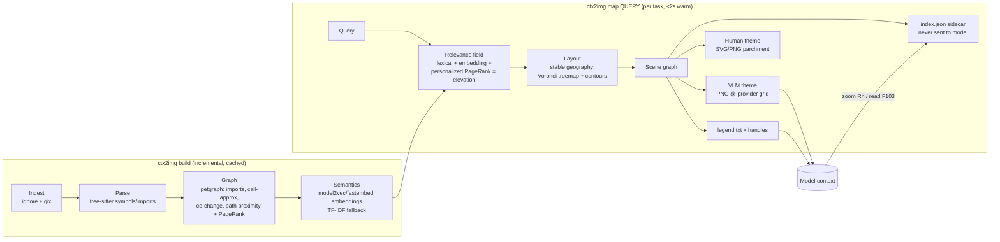

# ctx2img — Design Document

**Status:** v0.2 (text-bearing atlases) · 2026-07-16
**Repo:** `h5i-ctx2img` · **Working binary name:** `ctx2img`

A Rust tool that compiles a repository (plus task context: prompts, docs, any text)
into a **query-conditioned semantic map image** — a "Repository Atlas" — where the
territories carry **the actual text, typeset inside their cells**, and the cartography
(position, area, elevation, roads) carries the semantics. A small machine-readable
legend and stable handles let the model recover guaranteed-exact source text whenever
pixels aren't good enough. One artifact pipeline, multiple render targets: a *VLM
theme* engineered for machine legibility, an *inscribe mode* where the text is the
terrain, and a *human theme* (cartographic eye-candy) engineered for GitHub traction.

---

## 1. Thesis

> **The map carries the text; the geography carries the meaning; zoom carries the
> guarantee.**

(v0.2 revision — v0.1 said "pixels carry structure, not text". The evidence base
below supports a stronger position: pixels carry *structure and text*, with rendering
**density** as the explicit fidelity knob, and the handle/zoom system as the exactness
guarantee rather than the only text channel.)

1. **Pixels carry text at a chosen density.** Rendered text in images is
   token-cheaper than the same text as tokens (§2), and modern VLMs decode it
   reliably up to a model-dependent compression ratio. `ctx2img` typesets the actual
   source into each territory, at a density solved from the token budget and the
   target model's calibrated reading ability.
2. **Pixels also carry structure.** Topology, hierarchy, relevance, importance,
   hazards, and dependencies stay encoded as geography — the layout engine doubles
   as a typographic engine (text flows inside organic cells).
3. **Every element is addressable, and exactness is never *claimed* by pixels.**
   Handles (`R3`, `F103`, `S1042`) resolve to exact byte ranges via the sidecar.
   Anything the model must quote, edit, hash-compare, or execute is re-fetched as
   text (`ctx2img read`) — the image is evidence, the text channel is authority. This is
   the LensVLM loop, and it is what makes aggressive in-image compression safe.
4. **Instructions and policies still never go in pixels.** The security posture of
   v0.1 is unchanged: system-level instructions, security policy, and precedence
   rules live in the text control prompt only.
5. **Text-degradable.** The legend alone remains a usable aider-style text map.

## 2. Evidence base (why this exact shape)

| Finding | Source | Design consequence |
|---|---|---|
| Compressed-image-scan + selective `Expand()` to source reaches **full-text parity at ~4.3× effective compression**, beats RAG/LLMLingua/Glyph up to 10.1×; models average **1.3 expand calls**; works **zero-shot on commercial models** (+4.8–10.2pp on Sonnet 4.6) | LensVLM, arXiv:2605.07019 | The zoom protocol (§9) is the core loop, not an add-on. Expansion returns *text*, not higher-res images, whenever exactness matters. |
| Naive "render everything as an image" collapses: 31.3% vs 72.4% full-text at 5× | LensVLM | Never ship image-only context. Legend + handles always accompany the map. |
| Rendering config is the dominant risk: font alone swings accuracy up to **47pp**; failure mode is **reasoning collapse** (5–19× shorter outputs), not perception; optimal config is **model- and task-dependent** | "Reading, Not Thinking" arXiv:2603.09095; IPPg arXiv:2604.02492; Glyph arXiv:2510.17800 | Ship per-model **style presets** found by a calibration harness (§10), the way Glyph ran genetic search over rendering configs. Legibility is a tested property, not an assumption. |
| Visual context preserves **global structure** cheaply but loses **symbol-level fidelity**; code *completion* is the most fragile task, QA/summarization the most robust; UUID/rare-string tasks are hopeless in pixels | LongCodeOCR arXiv:2602.00746; CodeOCR arXiv:2602.01785; Glyph | Optimize **structure-per-token**, not text-per-token. The map answers "where/what/how-connected"; `read` answers "exactly what does it say". |
| ~10× optical compression retains ~97% precision at the OCR level; 1024² ≈ 256 vision tokens is a workable envelope for dense content | DeepSeek-OCR arXiv:2510.18234 | The information budget of a single 1–1.5k-token image is real but finite; don't try to draw 5k labeled nodes — aggregate, then zoom. |
| Natural document images can *outperform* text; synthetic renderings are a distribution mismatch | arXiv:2603.09095 | Bias the VLM theme toward document/diagram/map conventions models saw in pretraining (real cartography, real legends), not an invented grammar. |
| No existing tool renders a repo as a 2D map **as the LLM context format**; cartographic code viz (CodeCity, CodeCharta, Kuhn's Software Cartography/CodeMap, CodeSurveyor, anvaka's map-of-github) all predate or ignore LLM consumption; LLM repo-map tools (aider, CodeBoarding) all emit text | prior-art survey | The niche is open. Kuhn's CodeMap (arXiv:1001.2386) — vocabulary-similarity layout + contour terrain + **layout stability** — is the closest academic ancestor and validates the cartographic metaphor. |

### Image token economics (verified against provider docs, 2026-07)

Cost of one 1024×1024 image: **Claude 1369** (⌈w/28⌉×⌈h/28⌉; high-res tier accepts up to
2576px / 4784 tok), **GPT-5 630 / GPT-4.1 765** (tile-based), **GPT-5.4+ 1024** (32px
patches), **Gemini 3: fixed 280/560/1120/2240** by `media_resolution`, **Qwen3-VL 1026**
(32² blocks), **Qwen2.5-VL 1371** (28² blocks).

Worked example, 2,000-file repo, task "fix the session-expiry bug":

| Context strategy | Tokens (order of magnitude) |
|---|---|
| Full-repo text dump | millions (impossible) |
| aider repo-map covering meaningful slice of 2k files | 15–30k (or 1k covering a sliver) |
| **Atlas:** control prompt ~200 + legend ~600 + 1092² map (Claude: 1521) | **~2.3k, whole-repo coverage** |
| + avg 1.3 zooms (region tile ~800 or text read ~500) | **~3.5–4.5k total** |

Honest caveat: below roughly ~300 files a text map is usually cheaper and safer.
`ctx2img` computes both costs and **auto-selects the cheaper representation** that fits the
budget (`--representation auto`). We win on medium-to-huge repos and on
whole-repo-awareness tasks, and we say so in the README instead of overclaiming.

### The density model (v0.2 core)

Whether text-in-pixels is trustworthy is not a yes/no question — it is a **density**
question. The literature pins the curve well enough to engineer against:

| Regime | Compression vs text tokens | Evidence | Use |
|---|---|---|---|
| **Lossless-legible** (mono ≥ ~14 px) | ~1–1.5× | trivially readable by all current VLMs | prompts, docs, small tiles |
| **Compressed-legible** (~9–13 px) | ~2–4× | 97–99% acc at ~2:1 zero-shot (Text-or-Pixels); 3–4× parity (Glyph); syntax-highlight helps ≤4× (CodeOCR) | **default map body** |
| **Frontier-only** (~6–9 px) | ~4–8× | Gemini-3-Pro holds code QA/summarization at 8×; open models cliff | opt-in per calibrated model |
| **Texture** (< ~6 px) | >8× | gist/shape only | L1 overview of huge repos, where the structural channel dominates and zoom recovers text |

Worked example (Claude high-res tier, 2576×2576 = 4784 tokens): DejaVu Mono at 12 px
(≈7.2 px advance, 14 px leading) fits ≈ 65k characters ≈ 16k text-tokens → **~3.4×
effective compression** inside the safe regime; at 8 px ≈ 147k chars → ~7.7× for
calibrated-frontier use. One image ≈ a whole module; a medium repo ≈ a handful of
L2 tiles; a huge repo keeps a structural L1 with text-as-texture.

Density is solved per render: `density = f(budget, provider patch grid, model preset
from calibration §10)`. *(v0.3)* Text-bearing maps default to **box layout** —
a squarified treemap of rectangles, one per file/section, ↵-reflow-packed —
because rectangles tile exactly (no corner waste, no inter-cell channels);
the organic Voronoi geography remains the index/human layout and is one
`--layout organic` away. Text cells keep **pure-paper backgrounds** — the
elevation band moved from the fill to the **border (color + weight,
1.6px valley → 4.6px summit)** plus the header's printed ▲n: a background
tint taxes every glyph's contrast to encode one per-box attribute, a
border encodes it for a few hundred pixels at zero contrast cost. A/B at equal budget (crates/ctx2img-core, 2,600 tok,
2026-07-16, in-session VLM read): boxes carried ~2–3× more source (several
files complete vs +143/+242/+518-line spills), equal per-glyph legibility;
organic additionally suffers edge-curves crossing body text. The index
atlas stays Voronoi deliberately: its payload is *stable spatial memory*,
and treemap layouts reshuffle when file-size order changes. Content that doesn't fit at the chosen density spills in
relevance order to a `⋯ ctx2img read F#` marker — coverage degrades explicitly, never
silently.

**Exactness discipline.** Transcription probes (§10) measure each model's per-density
character accuracy; the shipped presets stay inside the ≥99% band. Independent of
that, the contract stays: pixels are for *reading*, `ctx2img read` is for *quoting* —
the escape hatch is what lets the default density be aggressive.

**`ctx2img paint` is the front door** (promoted from peer surface, 2026-07-16): it
dispatches on input shape and always carries the full text — directory → atlas
folio (L1 overview + inscribe tiles per region, budget-governed, coverage
reported); markdown → section map (headings become territories, query-banded);
flat text → dense pages. The index-only atlas survives as `ctx2img paint --index`
(the `map` subcommand was folded into it, 2026-07-16); prose below that says
`ctx2img map` describes that mode. Original framing kept below for context:

**Beyond repos — `ctx2img paint` is a peer product surface, not an afterthought.**
The tool's real subject is *any text an agent must ingest*: system prompts, tool
docs, human-typed prompts, markdown/docs, logs, papers, transcripts. Two input
shapes share one engine:

- **Structured corpora** (repos, doc trees) → the full atlas: geography +
  relevance + handles + zoom.
- **Text streams** (a prompt, a file, stdin) → `ctx2img paint`: the same
  budget-solved density typesetting on folio pages, with the same spill
  discipline and token accounting, plus lightweight structure (heading-derived
  sections as territories when the text has structure worth mapping).

The success metric for both is identical: **tokens cut without comprehension
loss — ideally comprehension gained** (the map/section layer gives the model an
overview a flat text stream never had). Every `paint`/`map` invocation reports
the counterfactual: text tokens the content would have cost vs image tokens
actually spent, so the cut is measured per call, never asserted.

## 3. Goals / non-goals

**Goals**

- G0. *(v0.2)* **Text-bearing maps**: territories typeset their actual content at a
  budget-solved density; the map is simultaneously the index *and* (within the
  calibrated density regime) the content. `ctx2img paint` extends this to arbitrary text.
- G1. Whole-repo situational awareness for a VLM in ≤ ~2.5k tokens (map + legend), with
  lossless zoom-to-source via handles.
- G2. Query-conditioned relevance baked into the image (elevation), so the model's first
  glance already ranks where to look.
- G3. Deterministic, incremental, fast: warm re-render < 2s on a 5k-file repo; identical
  inputs → byte-identical outputs.
- G4. Model-agnostic: provider profiles (Claude/OpenAI/Gemini/Qwen) drive raster size,
  patch-grid snapping, and style presets.
- G5. A human render mode beautiful enough that people share it — the growth engine.
- G6. Measured, not vibes: a benchmark harness that reports localization accuracy vs
  aider-style text maps at matched token budgets, per model.

**Non-goals**

- N1. *(revised in v0.2 — was "never render text into images")* Training or requiring
  a **custom decoder**: `ctx2img` renders text only at densities the *target stock model*
  is calibrated to read; it does not chase DeepSeek-OCR-class 10–20× ratios that need
  a trained decode path.
- N2. Being a general graph-viz library, IDE plugin, or server (v1 is a stateless CLI
  plus a bundled agent skill; no MCP server — see §9).
- N3. Semantic *execution* understanding (no dynamic analysis in v1; call edges are
  static approximations, labeled as such).
- N4. Putting any instruction, policy, or security-relevant rule in pixels — ever.
  The tool refuses and warns if configured to embed instruction files in the map body.

## 4. System architecture



### Crate workspace

| Crate | Responsibility | Key deps |
|---|---|---|
| `ctx2img-core` | ingest, parsing, graph, metrics, relevance scoring | `ignore`, `gix`, `tree-sitter` 0.26 (+ language packs), `petgraph` 0.8 (`page_rank`), `model2vec-rs` (default) / `fastembed` (feature), `rayon` |
| `ctx2img-layout` | stable geography: weighted Voronoi treemap (Nocaj–Brandes power diagrams — **we implement this; no maintained crate exists**, over `delaunator`/`voronoice`), marching-squares contours, force-refinement, edge bundling | `delaunator`, `kiddo` |
| `ctx2img-render` | scene graph → SVG and raster; themes; label layout & collision | `tiny-skia` 0.12, `cosmic-text` 0.19 (shaping/measurement), `resvg`/`usvg` 0.47 (SVG export path), `image` |
| `ctx2img-index` | handle registry, sidecar store, content-hash cache, legend emission | `serde`, `blake3` |
| `ctx2img-cli` | UX, provider profiles, budget solver, `auto` representation picker, `--json` output for agent hosts | `clap` |
| `ctx2img-eval` | calibration + benchmark harness (talks to provider APIs) | `reqwest`, provider SDKs |

(No server crate: agent integration is a bundled skill over the stateless CLI, §9. An
`rmcp`-based MCP wrapper is deliberately deferred to the post-v1 backlog.)

All pure Rust; no C deps required in the default build (`gix` over `git2`,
`tiny-skia` over cairo). `git2` stays available behind a feature flag as fallback.

### CLI sketch

```bash
ctx2img build [--rev HEAD]                    # (re)index → .ctx2img/ cache
ctx2img map "fix session expiry bug" \
    --provider claude --budget 2000 \
    --out atlas.png                       # emits atlas.png + legend.txt + updates handle registry
ctx2img zoom R3  --budget 1200                # region tile (image+text) or text-only detail
ctx2img read F103 [--lines 40:120]           # exact source (Layer 3)
ctx2img locate "session|expiry"               # grep → handles
ctx2img render --theme parchment --format svg # human mode, infinite-zoom SVG
ctx2img calibrate --provider claude           # legibility probe → tuned style preset
ctx2img bench --suite localization            # accuracy-vs-budget benchmark
```

## 5. Data model

### 5.1 Entities and handles

- `R<n>` — region: a directory/module/subsystem (aggregation unit on the map).
- `F<n>` — file.
- `S<n>` — symbol (function/class/trait…), only surfaced at zoom level 2+.
- `X<n>` — external dependency (crates/packages; drawn as offshore islands).

Handles are **stable and never reused**: a persistent registry (`.ctx2img/handles.json`)
maps handle → path (+ content hash). Renames are followed via git similarity; deleted
entries are tombstoned. Stability matters because handles appear in conversation
transcripts, h5i traces, and cached prompts — a handle must mean the same thing tomorrow.

### 5.2 The output triple

Every `ctx2img map` emits exactly three artifacts:

1. **`atlas.png`** — the map, rasterized to the provider's patch grid (§7.3).
2. **`legend.txt`** — small (~400–700 tokens), goes into the model's *text* context:
   - the visual grammar (fixed, versioned schema — see §6),
   - the region roster: `R3 src/auth/ — 14 files · elev 5/5 · top: F103 session.rs, F87 jwt.rs · calls→ R7(db) R2(http)`,
   - zoom instructions ("call atlas_zoom(R3) / atlas_read(F103)").
   The roster is deliberately a complete degraded fallback: legend-only ≈ aider repo map.
3. **`index.json`** — sidecar resolving handles to `{path, byte_range, hash, kind}`.
   Consumed by `ctx2img read`/`ctx2img zoom`, **never** placed in model context.

### 5.3 Scene graph

Layout and theming are decoupled through a typed scene graph
(`Region{poly, elev, handle}`, `Node{pos, size, kind}`, `Edge{kind, path}`,
`Label{text, anchor, priority}`, `Overlay{hazard|coverage|churn}`). Both themes and both
output formats (PNG/SVG) render the same scene; tests assert on the scene graph, not pixels.

## 6. Visual grammar (the VLM theme)

Principle from the evidence: **lean on conventions the model already knows** (real
cartography, real legends, choropleth/contour maps) instead of inventing grammar; encode
every semantic channel **redundantly** (position + color + pattern + label); keep
channels **categorical** (discrete bands), not continuous.

| Channel | Encodes | Encoding (redundant) |
|---|---|---|
| Position / adjacency | directory hierarchy + semantic similarity + coupling | nested Voronoi cells; co-changed/similar modules adjacent |
| Cell area | code mass (log LOC + symbol count) | area + roster ordering |
| **Elevation** | **query relevance (5 discrete bands)** | sequential color band + contour lines + band number printed in region label (`R3 ▲5`) |
| Borders | package/module boundary strength | line weight + closed contour |
| Roads | dependencies | solid arrow = call edge, dashed = import; bundled; only top-k by weight at L1 |
| City glyphs | importance (PageRank, entry points) | circle size + label priority |
| Hazard overlay | untrusted input / network / secrets / injection surface | red diagonal hatch + `⚠` in roster |
| Coverage layer (optional) | test coverage / churn | green stipple / heat ring |
| Sea + islands | external dependencies | offshore islands labeled `X<n>` |

**Typography rules** (from the 47pp-font-swing finding): one workhorse sans (embedded,
never system-dependent); label height ≥ ~18–24 px at final raster (IPPg found 24–32pt ≫
16pt); hard floor enforced by the layout engine — if a label can't fit legibly, it is
dropped from the image and lives only in the roster. No rotated text at L1. Label
collision resolved by priority (elevation × importance), greedy with displacement.

**What is never drawn as content:** source code, config values, IDs/hashes, numbers that
must be exact, and instructions. Labels are *names + handles* only.

The grammar is versioned (`atlas-schema v1`) and restated in every legend, so the model
never depends on having seen the schema before.

## 7. The pipeline in detail

### 7.1 Index (`ctx2img build`)

1. **Ingest** — `ignore` walk (respects `.gitignore` + `.ctx2imgignore`); `gix` for history:
   commit recency, churn, co-change coupling (files committed together), authorship
   entropy. Language detection by extension + shebang.
2. **Parse** — tree-sitter with per-language queries (start: Rust, Python, TS/JS, Go,
   Java; the aider/grep-ast `.scm` tag-query approach is proven — def/ref tags are enough
   for a useful reference graph, full call resolution is not required for v1).
3. **Graph** — petgraph digraph; nodes = files (symbols attached); edges = imports,
   name-reference edges (aider-style def→ref matching, sqrt-damped), co-change, sibling
   proximity. Importance = built-in `page_rank`.
4. **Semantics** — default embedder `model2vec-rs` (static embeddings: fast, small,
   CPU-only, no ONNX runtime — the "just works" path); `fastembed`/ONNX behind a feature
   for quality; pure TF-IDF fallback with zero model downloads. Embeds file summaries
   (path + top identifiers + doc comments), not full bodies.
5. **Cache** — everything keyed by `blake3(file content)`; graph deltas recomputed only
   for changed files. Cache lives in `.ctx2img/` (gitignored by default).

### 7.2 Relevance = elevation (`ctx2img map <query>`)

Score per file, combined with fixed, documented weights (tunable):

```
elev(f) = w1·bm25(query, f)                    # lexical (identifiers weighted high)
        + w2·cos(embed(query), embed(f))       # semantic
        + w3·ppr(f | seeds)                    # personalized PageRank diffusion from
                                               #   top lexical/semantic seed files
        + w4·churn_recency(f)                  # recently-touched bias (optional)
```

then quantized to 5 bands. Diffusion is what makes the map smarter than grep: the seed
hits pull in their structural neighborhood (the middleware that calls the auth module,
the tests that cover it), exactly what personalized PageRank does for aider — but here
the result is *painted*, whole-repo, in one glance.

Region elevation = max of members (a region containing one hot file must look hot).

### 7.3 Layout: stable geography

The single most important property (validated by Kuhn's CodeMap): **the map must look
the same across queries and across commits**, so both humans and cached-prompt VLMs
build spatial memory. Query changes elevation *colors*; geography moves only when code
structure moves, and then only locally.

- **Global placement:** top-level regions seeded on a 2D canvas by embedding-similarity
  MDS, then relaxed. Seed positions are hashed from stable region identity → determinism.
- **Hierarchy:** weighted Voronoi treemap (Nocaj–Brandes power-diagram iteration —
  implemented in `ctx2img-layout`; verified: no maintained Rust crate exists). Voronoi cells,
  unlike squarified treemaps, give organic country-like shapes (the human theme depends
  on this) and better area accuracy.
- **Incrementality:** cell sites carry over between builds; new files spawn at their
  parent's centroid; areas re-relax locally. A file rename must not reshuffle the map.
- **Contours:** elevation field sampled on a grid → marching squares → smoothed
  isolines. **Edges:** force-directed bundling (top-k edges only at L1).
- Determinism everywhere: fixed seeds, no HashMap iteration order leaks (BTreeMap/sorted
  iteration at every layout boundary), `f32` ops in fixed order.

### 7.4 Raster budgeting (provider profiles)

The budget solver picks raster dimensions so the *provider-computed* token cost fits
`--budget`, and snaps to the provider's patch grid so no pixels are wasted on padding:

| Profile | Grid snap | Example fit for budget 2000 |
|---|---|---|
| `claude` | 28 px, cap 2576 px / 4784 tok (high-res tier) | 1232×1232 → 44²=1936 tok |
| `openai-tile` (gpt-4o/4.1/5) | 512-px tiles, shortest side 768 | 1024×1024 → 630–765 tok |
| `openai-patch` (mini/nano/5.4+) | 32 px, 1536-patch budget | sized to patch budget |
| `gemini3` | fixed `media_resolution` steps (280/560/1120/2240) | pick step ≤ budget |
| `qwen3-vl` | 32 px | 1408×1408 → 1936 tok |

Render is vector-first; we rasterize at exactly the resolution the provider will see
(never let the provider resize — resize is where thin strokes and small labels die).

## 8. Layered context protocol

```
Layer 0  (text, ~200 tok)   task, tool instructions, precedence rules — NEVER in pixels
Layer 1  (image+text)       whole-repo atlas + legend/roster
Layer 2  (image+text)       region tile: files as sub-cells, symbol cities, local edges,
                            1-line summaries in the tile's text roster (not in pixels)
Layer 3  (text only)        exact source: ctx2img read F103 — code is always text
```

L2 tiles reuse the same grammar at higher magnification (same theme, same legend schema).
L3 is deliberately text: LensVLM found expansion-to-source is what restores parity, and
CodeOCR shows code-in-pixels fails exactly when precision matters.

## 9. Agent integration: a skill over a stateless CLI

The zoom protocol needs no server. Every operation is a pure function of what is on
disk (`.ctx2img/` index cache + handle registry + working tree) — there is no session state
to hold between calls — so each step is a fresh CLI invocation:

| Verb | Sig | Returns |
|---|---|---|
| `ctx2img map` | `"<query>" --budget --provider [--json]` | writes L1 atlas image; prints legend + artifact paths to stdout |
| `ctx2img zoom` | `<R\|F handle> [--mode image\|text]` | L2 tile image + roster, or text-only detail |
| `ctx2img read` | `<F\|S handle> [--lines a:b]` | exact source text (L3), with `path:line` provenance |
| `ctx2img locate` | `"<pattern>"` | matching handles + one-line context |

The integration surface is a **bundled skill** (`skills/ctx2img/SKILL.md`, installable into
`.claude/skills/` or any host's skill directory). This is deliberately where the
leverage is: the hard part of the LensVLM loop working *zero-shot* is teaching the
**workflow**, and a skill document does that far better than MCP tool descriptions:

1. `ctx2img map "<task>" --provider claude --budget 2000 --out atlas.png` (auto-builds the
   index if missing/stale), then **read `atlas.png` with the host's file-read tool** —
   that is how the image enters context; stdout stays text (legend + paths).
2. Survey legend roster + map, pick handles; `ctx2img zoom R3` / `ctx2img read F103 --lines 40:120`.
3. Budget discipline: trust `--representation auto`; on small repos the legend alone is
   the context, no image read needed.

CLI consequences: a `--json` mode emitting `{atlas_path, legend, handles[]}` for
scripted hosts; quiet, parseable stderr and meaningful exit codes; every output
re-states the available next verbs (stateless affordances, as LensVLM's loop assumes).

**MCP is out of v1.** What it would buy — image bytes directly in tool results, and
hosts without shell access (claude.ai web, IDE-only surfaces) — is not needed by the
target audience (terminal coding agents, which all have Bash + file-read). Because the
core is stateless, an `rmcp` wrapper over the same functions is a small post-v1 add if
demand appears (backlog, §14 M5).

## 10. Calibration & evaluation (make legibility a tested property)

**Calibration harness (`ctx2img calibrate`)** — the answer to "your semantic grammar may not
be semantic to the model":

1. Generate synthetic repos with known ground truth (planted relevance, planted edges,
   planted hazards).
2. Render atlases across a style-parameter sweep (font size, band palette, contour
   density, label count, hatch style) — Glyph proved search over rendering configs is
   worth it.
3. Probe the target VLM with objective questions: "highest-elevation region?", "list
   handles inside R3", "which regions does R3 call?", "which region is hazard-marked?".
4. Score → per-model **style preset** shipped in the repo (`presets/claude.toml`, …),
   plus a public **legibility scorecard** per model in the README (this doubles as
   marketing).

**Benchmark harness (`ctx2img bench`)** — the headline numbers:

- *Localization*: SWE-bench-lite-style issues → does the model name the right
  file/region? Conditions: atlas+legend vs aider-map vs plain file list vs
  text-rendered-as-image, all at matched token budgets (1k/2k/4k), across
  Claude/GPT/Gemini/Qwen.
- *Whole-repo questions*: "where is auth handled?", "what depends on X?" — structure
  questions where the map should shine.
- *End-to-end*: tokens-to-correct-patch on a small agent loop with/without the atlas skill.
- Report accuracy *and* total tokens; publish the harness so results are reproducible.

Acceptance gates for calling the VLM theme "real": atlas ≥ text-map localization
accuracy at ≤ half the tokens on ≥2 frontier models; legibility probes ≥ 95% on
handle-reading tasks (if a model can't read handles, nothing else matters).

## 11. Human theme & traction plan

Same scene graph, different stylesheet — near-zero marginal engineering for the growth
engine:

- **`--theme parchment`**: hillshaded terrain, biome tints by language, coastlines
  (external deps as offshore islands), city glyphs, serif toponyms, compass rose +
  scale bar ("1 cm ≈ 2,000 LOC"), subtle paper grain. SVG output → infinite zoom.
- **`ctx2img badge`**: GitHub Action that re-renders the map on push and commits it to the
  README (the repo-visualizer Action proved this loop drives adoption; it's dormant —
  we take the slot with a far prettier artifact).
- **`ctx2img diff --map`**: two revisions → annotated map of what moved (PR hero images).
- Social card export (1280×640), optional git-history timelapse (Gource's 13k★ show the
  appetite) — post-v1.
- Launch story: "your repo as a map your AI can actually read" — the eye-candy pulls
  people in, the benchmark table (§10) makes it defensible, the bundled skill makes it
  useful in the first five minutes (`cp -r skills/ctx2img .claude/skills/`). This repo
  dogfoods its own badge from day one.

## 12. Performance & determinism targets

- Cold index, 5k-file repo: < 30 s (rayon-parallel parse+embed). Warm re-render after
  small edit: **< 2 s**; query-only change (re-elevation + restyle, no re-layout): < 500 ms.
- Byte-identical output for identical (repo state, query, preset, seed) — required for
  prompt caching, snapshot tests, and h5i audit trails.
- Memory: index for 5k files < 500 MB RSS; sidecar + cache on disk < 50 MB typical.
- Snapshot tests on scene graphs (structural) + golden-image tests per theme (pixel).

## 13. Risks & mitigations

| Risk | Severity | Mitigation |
|---|---|---|
| VLMs misread the grammar zero-shot | **High** | calibration presets per model (§10); legend restates schema every time; roster is a complete text fallback; acceptance gates before claiming wins |
| Image tokens not actually cheaper on small repos / Claude's per-patch pricing | Med | `--representation auto` computes both costs and picks; publish the honest break-even analysis |
| Provider resize destroys fine strokes | Med | render at exact provider-native resolution, snap to patch grid, min stroke/label floors |
| Voronoi-treemap implementation complexity | Med | it's the one novel algorithmic piece; Nocaj–Brandes is well-documented; fall back to squarified treemap (`streemap`) behind the same scene-graph interface if it slips |
| Handle drift breaking cached prompts/transcripts | Med | persistent registry, tombstones, rename-following (§5.1) |
| Prompt-injection via file contents leaking into the map | Med | labels are names+handles only, sanitized charset; file *content* never rasterized at L1/L2; hazard layer actively marks untrusted-input surfaces |
| Scope creep into IDE/graph-viz platform | Med | non-goals (§3); CLI + skill only for v1 |
| Reasoning collapse on image input (models answer tersely) | Low-Med | map is for *navigation*, reasoning happens over L3 text; control prompt keeps chain-of-thought in text; inscribe-mode instructions say "transcribe the relevant region before reasoning" |
| *(v0.2)* Character errors in in-image text at aggressive density | **High if unmanaged** | density presets held inside the ≥99% transcription band per model (§10); spill/`read` escape hatch; pixels never authoritative for quoting/editing |
| *(v0.2)* Non-mono/unicode-heavy content renders poorly at small sizes | Med | mono font, unicode fallback boxes counted as spill; density floor raised for non-ASCII-dense files |

## 14. Milestones

- **M0 — Index + text map (parity baseline).** ingest/parse/graph/PageRank + legend-only
  output ≈ aider repo map. Useful alone; becomes the benchmark control arm.
- **M1 — Static atlas, human theme.** Voronoi treemap + contours + parchment render +
  `ctx2img badge`. *Ship the eye-candy first — traction starts here.*
- **M2 — Query-conditioned VLM theme.** relevance field, elevation bands, handles,
  legend/roster, provider budget solver.
- **M3 — Zoom protocol.** L2 tiles, `read`/`locate`, `--json` mode, bundled agent skill.
- **M4 — Calibration + benchmarks.** presets per model, public scorecard, README table.
- **M5 — Growth features.** GitHub Action polish, `diff --map`, social cards, timelapse;
  optional `rmcp` MCP wrapper if non-shell hosts ask for it.

**v0.2 milestones (text-bearing atlases):**

- **M6 — Text-flow engine.** Typeset arbitrary text inside territory polygons
  (scanline row intervals, mono metrics, wrap markers, comment dimming, spill
  markers). Prototype target: `ctx2img zoom R# --inscribe`.
- **M7 — Density solver + presets.** Budget × provider grid × model preset → px
  size; explicit spill accounting in the tile roster.
- **M8 — `ctx2img paint`.** Arbitrary text/stdin → map-folio image(s) at budgeted
  density (the general prompt-compression entry point).
- **M9 — Inscribe aesthetics.** Typographic-map styling: region-name watermarks,
  elevation wash under text, illuminated capitals for summits — the text *is* the
  terrain, and it must be beautiful enough to share.
- **M10 — Density calibration.** Transcription/needle/QA probes over a density
  ladder per model → shipped `presets/*.toml`; README scorecard gains a
  max-safe-density column.

Each milestone is independently demoable; M0→M2 are sequential, M1 can proceed in
parallel with M2 after M0.

## 15. Open questions

1. **Name.** `ctx2img` is descriptive; a shorter brand (binary `ctx2img` regardless)
   with a free crates.io slot should be picked before first publish.
2. Symbol-level graph depth for v1 (file-level edges may be enough; symbol cities can be
   cosmetic until L2 needs them).
3. Whether L2 tiles should ever include rendered one-line summaries in pixels, or keep
   *all* prose in the tile roster (current lean: all prose in text — evidence favors it).
4. Hazard heuristics scope for v1 (regex/taint-pattern based vs tree-sitter-aware).

## 16. References

LensVLM arXiv:2605.07019 · DeepSeek-OCR arXiv:2510.18234 · Glyph arXiv:2510.17800 ·
"Text or Pixels? It Takes Half" arXiv:2510.18279 · "Reading, Not Thinking"
arXiv:2603.09095 · Image Prompt Packaging arXiv:2604.02492 · CodeOCR arXiv:2602.01785 ·
LongCodeOCR arXiv:2602.00746 · VIST arXiv:2502.00791 · SeeTok arXiv:2510.18840 ·
Software Cartography/CodeMap arXiv:1001.2386 · Nocaj & Brandes, "Computing Voronoi
Treemaps" (2012) · aider repo-map (aider.chat/docs/repomap.html) · githubocto/repo-visualizer ·
anvaka/map-of-github · provider vision docs (Anthropic/OpenAI/Google/Alibaba, checked 2026-07-16).
